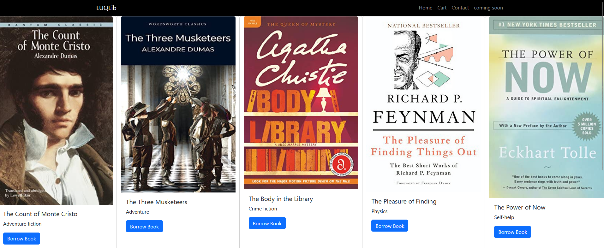
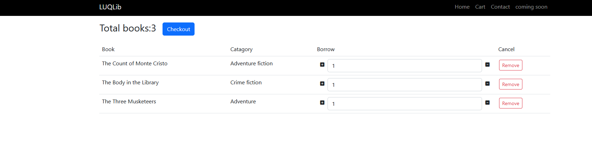

# Library System Web Application (Java Servlets and JSPs)

Welcome to the Library System Web Application repository! This project aims to provide a user-friendly web app for managing library activities such as book borrowing. The application is built using Java Servlets and JSPs, incorporating essential features including a secure login system, intuitive navigation, and a streamlined process for borrowing books.
Features

- User Authentication: Our application ensures secure access with a robust login system implemented using Java Servlets. Users can create accounts, log in securely, and maintain the privacy of their personal information.

- Effortless Navigation: Navigating through the app is a easy with JSPs rendering dynamic content. With a user-friendly interface, you'll quickly find what you're looking for. Intuitive menus and clear categorization enhance the overall user experience.

- Book Borrowing: Borrowing books has never been easier. Users can search for available books, view detailed information about each book through JSPs, and initiate the borrowing process with just a few clicks.

The app was developed in Eclipse IDE

Here are images about the app:

